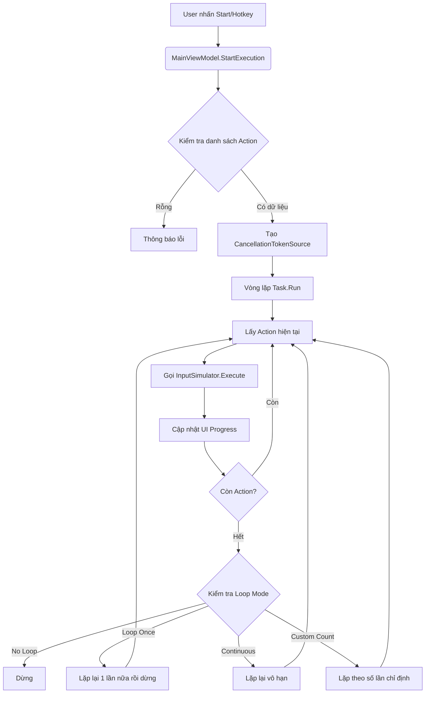
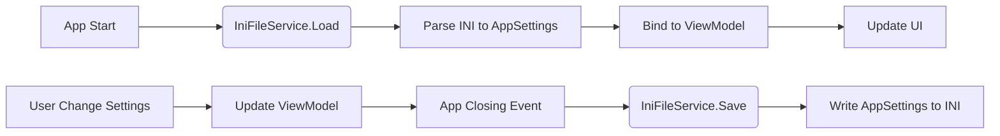

# Tài Liệu Phát Triển - Auto Clicker & Keyboard

## Mục Lục
1. [Tổng Quan Kiến Trúc](#tổng-quan-kiến-trúc)
2. [Sơ Đồ Luồng Dữ Liệu](#sơ-đồ-luồng-dữ-liệu)
3. [Chi Tiết Các Class & Function](#chi-tiết-các-class--function)
4. [Mối Liên Kết Giữa Các Component](#mối-liên-kết-giữa-các-component)
5. [Hướng Dẫn Mở Rộng](#hướng-dẫn-mở-rộng)

---

## 1. Tổng Quan Kiến Trúc

Dự án sử dụng mô hình **MVVM (Model-View-ViewModel)** kết hợp với **Service Pattern**.

```
┌─────────────────────────────────────────────────────────────┐
│                        VIEW (WPF UI)                        │
│  MainWindow.xaml + Styles.xaml (Giao diện người dùng)       │
└──────────────────────┬──────────────────────────────────────┘
                       │ Binding (Two-way)
┌──────────────────────▼──────────────────────────────────────┐
│                   VIEWMODEL (Logic UI)                      │
│  MainViewModel.cs (Quản lý trạng thái, lệnh, dữ liệu)       │
└─────────┬──────────────────────────────────────┬────────────┘
          │ Gọi phương thức                      │ Lắng nghe sự kiện
┌─────────▼────────────┐              ┌──────────▼────────────┐
│   SERVICES           │              │      MODELS           │
│ - InputSimulator     │              │  - ActionItem         │
│ - IniFile            │              │  - AppSettings        │
└──────────────────────┘              └───────────────────────┘
          │
          ▼ Gọi WinAPI
┌─────────────────────┐
│   WINDOWS API       │
│ (user32.dll, ...)   │
└─────────────────────┘
```

---

## 2. Sơ Đồ Luồng Dữ Liệu

### Luồng thực thi tự động (Auto Execution Flow)



### Luồng lưu tải cấu hình (Config Flow)



---

## 3. Chi Tiết Các Class & Function

### A. Models (`Models/`)

#### 1. `ActionItem.cs`
Đại diện cho một hành động đơn lẻ (Phím hoặc Click).

*   **Properties:**
    *   `Id` (int): Định danh duy nhất.
    *   `Type` (enum: `KeyPress`, `MouseDown`, `MouseUp`, `Click`, `Delay`): Loại hành động.
    *   `KeyCode` (System.Windows.Input.Key): Phím cần nhấn (nếu là KeyPress).
    *   `X`, `Y` (int): Tọa độ màn hình (nếu là Mouse).
    *   `DelayMs` (int): Thời gian chờ sau khi thực hiện hành động này.
    *   `Description` (string): Mô tả hiển thị trên UI.

#### 2. `AppSettings.cs`
Lưu trữ toàn bộ cấu hình ứng dụng.

*   **Properties:**
    *   `HotKeyStart` (string): Phím tắt bắt đầu (ví dụ: "F6").
    *   `HotKeyStop` (string): Phím tắt dừng (ví dụ: "F7").
    *   `LoopMode` (enum): Chế độ lặp.
    *   `LoopCount` (int): Số lần lặp (nếu chế độ Custom).
    *   `GlobalDelay` (int): Độ trễ mặc định giữa các action.
    *   `ActionList` (ObservableCollection<ActionItem>): Danh sách các hành động đã lưu.

---

### B. ViewModels (`ViewModels/`)

#### 1. `MainViewModel.cs`
Trái tim của ứng dụng, xử lý logic nghiệp vụ.

*   **Implement:** `INotifyPropertyChanged`
*   **Properties chính:**
    *   `Actions` (ObservableCollection<ActionItem>): Danh sách hiển thị trên ListBox.
    *   `IsRunning` (bool): Trạng thái đang chạy/dừng.
    *   `CurrentIndex` (int): Chỉ số action đang thực thi (để highlight UI).
    *   `StatusMessage` (string): Thông báo trạng thái.
    *   `Settings` (AppSettings): Đối tượng cấu hình.
*   **Commands (ICommand):**
    *   `AddKeyCommand`: Thêm action phím.
    *   `AddClickCommand`: Thêm action click chuột.
    *   `DeleteCommand`: Xóa action được chọn.
    *   `MoveUpCommand` / `MoveDownCommand`: Sắp xếp lại thứ tự.
    *   `StartCommand`: Bắt đầu thực thi.
    *   `StopCommand`: Dừng thực thi khẩn cấp.
    *   `SaveConfigCommand`: Lưu manual.
    *   `LoadConfigCommand`: Tải manual.
*   **Methods quan trọng:**
    *   `ExecuteSequenceAsync()`: Hàm bất đồng bộ chứa vòng lặp chính để duyệt danh sách Action.
    *   `OnHotKeyPressed()`: Xử lý khi nhận được sự kiện phím tắt từ MainWindow.
    *   `ValidateActions()`: Kiểm tra tính hợp lệ trước khi chạy.

---

### C. Services (`Services/`)

#### 1. `InputSimulatorService.cs`
Wrapper cho các hàm WinAPI để giả lập input.

*   **Dependencies:** `user32.dll` (thông qua P/Invoke).
*   **Methods:**
    *   `SendKeyDown(Key key)`: Nhấn giữ phím.
    *   `SendKeyUp(Key key)`: Thả phím.
    *   `SendKeyPress(Key key)`: Nhấn và thả ngay (Click phím).
    *   `SetCursorPos(int x, int y)`: Di chuyển chuột đến tọa độ.
    *   `MouseClick(MouseButton button)`: Click chuột (Left, Right, Middle).
    *   `GetCursorPosition()`: Lấy tọa độ hiện tại của chuột (dùng cho tính năng "Record").
*   **Lưu ý kỹ thuật:** Sử dụng `SendInput` thay vì `key_event` cũ để tương thích tốt hơn với Windows 10/11 và game có chống cheat cơ bản.

#### 2. `IniFileService.cs`
Xử lý đọc/ghi file văn bản định dạng INI.

*   **Methods:**
    *   `Save(string path, AppSettings settings)`: Serialize object thành các section/key/value.
    *   `Load(string path)`: Parse file INI trả về object `AppSettings`.
    *   `ParseKeyString(string s)`: Chuyển chuỗi "F6" thành `Key.F6`.
    *   `ToStringKey(Key k)`: Chuyển `Key.F6` thành chuỗi "F6".

---

### D. View (`Views/`)

#### 1. `MainWindow.xaml`
Giao diện chính.

*   **Components:**
    *   `ListBox`: Hiển thị danh sách Action (ItemsSource bind vào `ViewModel.Actions`).
    *   `TextBox` / `ComboBox`: Nhập liệu cấu hình.
    *   `Buttons`: Các nút điều khiển (Bind Command).
    *   `ProgressBar`: Hiển thị tiến độ.
*   **Event Handlers (Code-behind minimal):**
    *   `Window_PreviewKeyDown`: Bắt phím tắt toàn cục khi window đang focus.
    *   `Window_Closing`: Gọi save config tự động.

#### 2. `Styles.xaml` (hoặc ResourceDictionary)
Chứa các Style, ControlTemplate để làm đẹp giao diện (Material Design look-and-feel).

---

## 4. Mối Liên Kết Giữa Các Component

### Bảng ma trận tương tác

| Component A | Tương tác với B | Mục đích | Cơ chế |
| :--- | :--- | :--- | :--- |
| **MainWindow** | **MainViewModel** | Hiển thị dữ liệu, nhận lệnh user | DataBinding (`{Binding}`), Commands |
| **MainViewModel** | **InputSimulatorService** | Thực thi hành động thực tế | Gọi method trực tiếp (`_inputService.Send...`) |
| **MainViewModel** | **IniFileService** | Lưu tải cấu hình | Gọi method trực tiếp (`_iniService.Save(...)`) |
| **MainViewModel** | **ActionItem** | Quản lý dữ liệu từng bước | Collection (`ObservableCollection`) |
| **InputSimulator** | **WinAPI (user32)** | Giao tiếp hệ điều hành | P/Invoke (`[DllImport]`) |
| **MainWindow** | **Hotkey Logic** | Lắng nghe phím tắt | Event `PreviewKeyDown` hoặc RegisterHotKey API |

### Chi tiết luồng gọi hàm khi nhấn "Start"

1.  **User** click nút Start trên `MainWindow`.
2.  `MainWindow` gửi lệnh tới `MainViewModel.StartCommand`.
3.  `MainViewModel`:
    *   Đổi trạng thái `IsRunning = true`.
    *   Gọi `ExecuteSequenceAsync()`.
4.  `ExecuteSequenceAsync()`:
    *   Lock UI (disable nút sửa xóa).
    *   Vòng `foreach` qua `Actions`.
    *   Với mỗi item, gọi `_inputSimulator.Execute(item)`.
    *   Cập nhật `CurrentIndex` (báo hiệu cho UI highlight dòng đang chạy).
    *   `await Task.Delay(item.DelayMs)`.
5.  Khi xong hoặc bị hủy:
    *   `IsRunning = false`.
    *   Unlock UI.

---

## 5. Hướng Dẫn Mở Rộng

Dưới đây là các gợi ý để phát triển thêm tính năng dựa trên kiến trúc hiện tại.

### 5.1. Thêm tính năng "Record" (Ghi lại thao tác)
*   **Vị trí code:** Thêm vào `InputSimulatorService` và `MainViewModel`.
*   **Cách làm:**
    1.  Sử dụng `LowLevelKeyboardProc` và `LowLevelMouseProc` (Hook API) trong `InputSimulatorService` để lắng nghe sự kiện bàn phím/chuột toàn cục.
    2.  Khi người dùng bấm "Record", kích hoạt Hook.
    3.  Mỗi khi Hook bắt được sự kiện -> Tạo mới một `ActionItem` và thêm vào `ObservableCollection Actions`.
    4.  Khi bấm "Stop Record", ngắt Hook.

### 5.2. Thêm điều kiện logic (If/Else, Tìm ảnh)
*   **Vị trí code:** Model `ActionItem` và `InputSimulatorService`.
*   **Cách làm:**
    1.  Thêm loại Action mới: `FindImage` hoặc `Condition`.
    2.  Tích hợp thư viện xử lý ảnh (như OpenCVSharp hoặc AForge.NET).
    3.  Trong `ExecuteSequenceAsync`, nếu gặp Action loại `FindImage`:
        *   Chụp màn hình vùng chỉ định.
        *   So sánh với mẫu.
        *   Nếu tìm thấy -> Tiếp tục. Nếu không -> Nhảy đến bước khác hoặc Dừng.

### 5.3. Hỗ trợ nhiều Profile (Kịch bản)
*   **Vị trí code:** `IniFileService` và `MainWindow`.
*   **Cách làm:**
    1.  Hiện tại file config là cố định `config.ini`.
    2.  Sửa thành cho phép người dùng chọn tên file (ví dụ: `profile1.ini`, `boss_fight.ini`).
    3.  Thêm menu "Load Profile" để đọc file tương ứng.

### 5.4. Đóng gói ứng dụng
*   Sử dụng công cụ như **Inno Setup** hoặc **WiX Toolset** để tạo file cài đặt `.exe` setup.
*   Đảm bảo include file `config.ini` mẫu trong thư mục cài đặt.

---

## 6. Các API Win32 quan trọng đã sử dụng

Nếu cần debug sâu, hãy nắm rõ các hàm native sau (trong `InputSimulatorService`):

1.  **`SendInput`**: Hàm quan trọng nhất. Gửi các sự kiện input giả lập xuống hệ thống. An toàn và nhanh hơn `key_event`.
2.  **`SetCursorPos`**: Di chuyển con trỏ chuột tuyệt đối.
3.  **`GetCursorPos`**: Lấy tọa độ hiện tại.
4.  **`mouse_event`**: (Cũ) Dùng để click chuột nếu `SendInput` gặp vấn đề với một số game cũ.
5.  **`MapVirtualKey`**: Chuyển đổi giữa mã phím ảo (Virtual Key) và mã scan (Scan Code) để đảm bảo đúng phím trên mọi layout bàn phím.

---

*Lưu ý: Tài liệu này được cập nhật lần cuối cho phiên bản .NET Framework 4.6.2. Khi nâng cấp lên .NET Core hoặc .NET 5+, một số phần liên quan đến P/Invoke hoặc Thread có thể cần điều chỉnh nhẹ.*
