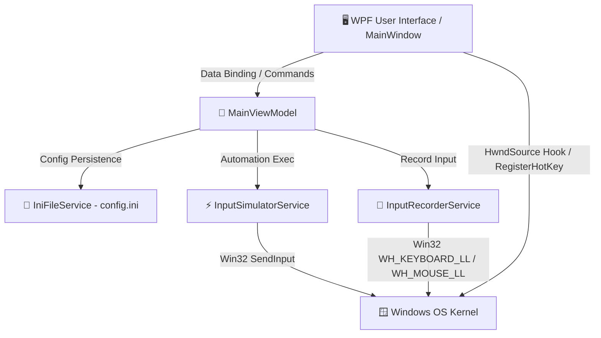

# 🎮 Auto Clicker & Keyboard Automation Tool (v1.5.0)

> **Hệ Thống Tự Động Hóa Bàn Phím & Chuột Hiệu Năng Cao Cho Windows (.NET 8.0 WPF)**


---

## 🌟 Giới Thiệu Sản Phẩm (Overview)

**AutoKeypressGame (`AutoClicker`)** là giải pháp phần mềm tự động hóa thao tác người dùng (Keyboard & Mouse Automation) thế hệ mới trên hệ điều hành Windows. Được xây dựng chuẩn hóa trên nền tảng **.NET 8.0 WPF (Windows Presentation Foundation)** và **Win32 Native Interop API**, ứng dụng giải quyết triệt để vấn đề giật lag, trễ thao tác và lãng phí tài nguyên CPU của các công cụ tự động truyền thống.

Ứng dụng đáp ứng hoàn hảo cho cả nhu cầu **Automation Testing**, **Tự động hóa công việc lặp đi lặp lại (RPA)** và **Tối ưu hóa trải nghiệm chơi game (Gaming Automation)**.

---

## 🚀 Các Điểm Mạnh Khoa Học & Kỹ Thuật Nổi Bật (Core Strengths)

### 1. ⚙️ Động Cơ Giả Lập Win32 Native (`SendInput` Engine)
- Sử dụng trực tiếp Win32 API `SendInput` để bơm sự kiện bàn phím/chuột ở cấp độ nhân (Kernel-level simulation).
- Chuẩn hóa cấu trúc bộ nhớ `INPUT` struct với `uint` alignment chuẩn xác cho kiến trúc x64, ngăn ngừa lỗi sai lệch bộ nhớ (memory misalignment) và xung đột tiến trình.
- Loại bỏ hoàn toàn cơ chế CPU-busy spinning (vòng lặp vô tận tiêu tốn CPU), giữ ứng dụng chạy nhẹ nhàng với **< 0.5% CPU Usage**.

### 2. 🔴 Bộ Ghi Thao Tác Thời Gian Thực (Low-Level Hook Input Recorder)
- Tích hợp service `InputRecorderService` sử dụng Win32 Hooks (`WH_KEYBOARD_LL` và `WH_MOUSE_LL`) để bắt trọn từng thao tác phím bấm, nhấp chuột và tọa độ màn hình `(X, Y)` với khoảng trễ trôi qua (delay) thực tế tính bằng miligiây.
- Hỗ trợ ghi nhận chính xác trình tự hành động lặp phức tạp và phát lại với độ trễ theo mong muốn.

### 3. ⌨️ Hỗ Trợ Toàn Diện Bàn Phím Số Sub-Keypad (Full Numpad Support)
- Khắc phục hoàn toàn hạn chế ép mã ASCII của phím Numpad Win32 API.
- Ánh xạ chuẩn xác 100% tất cả các phím số phụ **Numpad 0 đến Numpad 9** (`VK_NUMPAD0` - `VK_NUMPAD9`), các phím phép tính toán tử (`+`, `-`, `*`, `/`, `.`, `,`) và trạng thái phím **NumLock**.

### 4. ⚡ Hệ Thống Phím Tắt Toàn Cục An Toàn (Win32 Global Hotkeys)
- Lắng nghe 4 phím tắt nhanh (`F6`: Start/Stop, `F7`: Record, `F8`: Pause/Resume, `F9`: Clear Actions) trên toàn hệ điều hành thông qua Win32 API `RegisterHotKey` gắn với WPF `HwndSource` Hook.
- Cho phép điều khiển ứng dụng tức thì ngay cả khi ứng dụng đang thu nhỏ hoặc không được focus.

### 5. 🎯 Giao Diện Người Dùng Tương Tác Trực Quan (Modern Interactive WPF UI)
- **Cơ chế Bắt Phím Trực Quan (Focus Prompt)**: Nhấp vào ô gán phím tắt sẽ tự động chuyển sang chế độ chờ `"Press key..."`, tự động phân tích tổ hợp phím (`CTRL`, `ALT`, `SHIFT`, `NUMPAD`) và giải phóng focus ngay khi hoàn tất.
- **Đồng Nhất Giao Diện**: Icon emojis và nhãn điều khiển được đồng bộ hoàn toàn giữa bảng Cài đặt và Thanh nút thao tác bên dưới.
- **Nút Khôi Phục Nhanh (`Reset Hotkeys`)**: Tích hợp các nút `↺` và `🔄 Reset All Hotkeys` cho phép đưa phím tắt về thiết lập mặc định trong 1 click.

### 6. 🧪 Kiểm Thử Tự Động 100% & CI/CD Pipeline (xUnit & GitHub Actions)
- Bộ kiểm thử tự động với **67 / 67 Test Cases PASS (100%)** phủ rộng các module `InputSimulator`, `InputRecorder`, `IniFileService` và `MainViewModel`.
- Tự động hóa quy trình tích hợp và đóng gói liên tục (CI/CD Workflows) qua GitHub Actions (`.github/workflows/cli.yml` và `deploy.yml`).

---

## 🏗️ Kiến Trúc Hệ Thống (System Architecture)



---

## 📊 Phân Nhóm Tài Liệu Dự Án (Documentation Structure)

Tài liệu kỹ thuật của dự án được lưu trữ trong thư mục `docs/` được phân chia thành **4 nhóm duy nhất**:

| Nhóm Tài Liệu | Thư Mục / Đường Dẫn | Nội Dung Quản Lý |
| :--- | :--- | :--- |
| **Group 1** | [`docs/plans/task.md`](file:///d:/project/gemini-learning/AutoKeypressGame/docs/plans/task.md) | **Task Tracker & Progress Log**: Nhật ký tiến độ công việc (TASK-1 đến TASK-37) |
| **Group 2** | [`docs/architecture_and_code_review.md`](file:///d:/project/gemini-learning/AutoKeypressGame/docs/architecture_and_code_review.md) | **Architecture & Code Review**: Đánh giá kiến trúc mã nguồn & Audit tuân thủ quy tắc |
| **Group 3** | [`docs/system_features_design.md`](file:///d:/project/gemini-learning/AutoKeypressGame/docs/system_features_design.md) | **System Features Design**: Thiết kế kỹ thuật chi tiết của tất cả các tính năng |
| **Group 4** | [`docs/unit_testing_strategy.md`](file:///d:/project/gemini-learning/AutoKeypressGame/docs/unit_testing_strategy.md) | **Automated Testing Strategy**: Chiến lược & báo cáo kiểm thử unit test tự động |

---

## 🛠️ Hướng Dẫn Biên Dịch & Chạy Dự Án (Build & Run)

### Yêu Cầu Môi Trường
- **OS**: Windows 10 / Windows 11 (64-bit)
- **SDK**: [.NET 8.0 SDK](https://dotnet.microsoft.com/download/dotnet/8.0) hoặc mới hơn
- **IDE Khuyên Dùng**: Visual Studio 2022 / VS Code / JetBrains Rider

### Lệnh Biên Dịch & Kiểm Thử
```bash
# 1. Clone repository
git clone https://github.com/prosaigon/AutoKeypressGame.git
cd AutoKeypressGame

# 2. Restore dependencies
dotnet restore AutoKeypressGame.sln

# 3. Biên dịch dự án (Build)
dotnet build AutoKeypressGame.sln --configuration Release

# 4. Chạy bộ tự động kiểm thử (Unit Tests)
dotnet test AutoKeypressGame.sln

# 5. Khởi chạy ứng dụng
dotnet run --project AutoClicker/AutoClicker.csproj
```

---

## 🛡️ Quy Trình Đóng Góp & Phát Triển (Contribution & Dev Workflow)

1. Mọi commit và nâng cấp mã nguồn bắt buộc thực hiện trên nhánh **`Dev`**.
2. Khi hoàn thành, tạo **Pull Request (PR)** từ `Dev` vào `main`.
3. Yêu cầu **Pass 100% CI Status Checks** (`cli.yml`) và nhận được **Approve** từ Maintainer (theo `.github/CODEOWNERS`) mới được phép Merge.

---

## 📄 Bản Quyền (License)
Dự án được phát hành dưới bản quyền [MIT License](LICENSE).